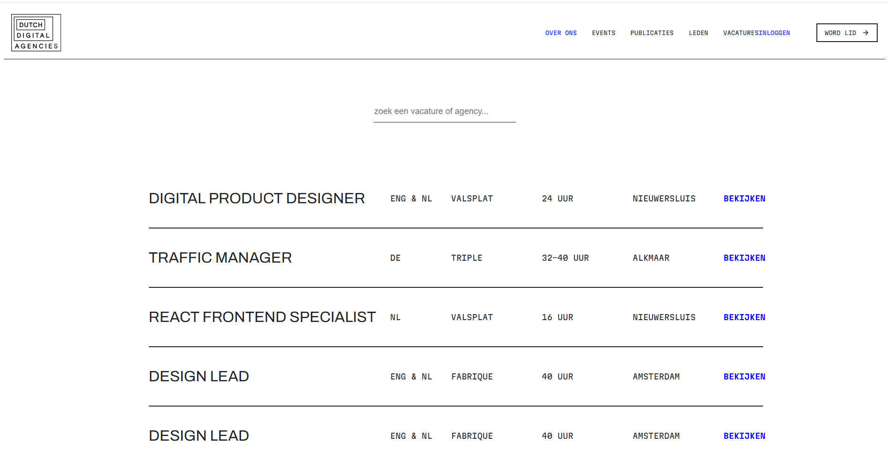
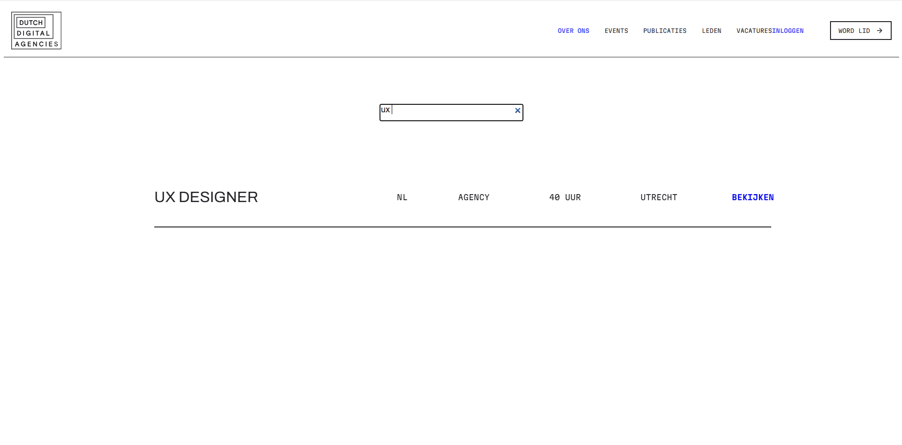
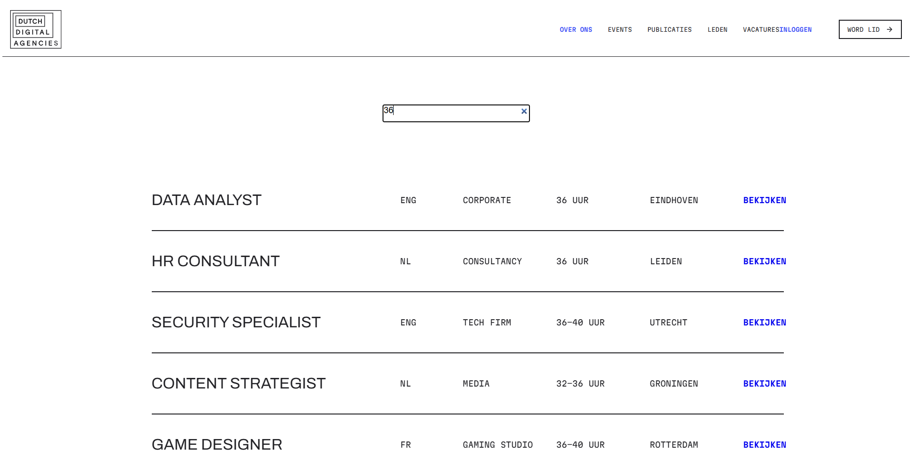

# DDA Vacature's

Ik heb voor DDA vacatures de Over Ons pagina en de Vacature pagina ontworpen, het probleem van DDA was dat ze een future proof website wouden. Hieronder is te zien waarom ik bepaalde keuze's heb gemaakt, en hoe ik die keuze's heb ontworpen met HTML / CSS / JS.

## Wie zijn DDA Vacature's eigenlijk?

DDA Vacature's is een vacature bedrijf waar je vacatures vind voor bij creatieve bureau's, zo vind je onder andere vacatures als: Designer, Scrum Master, Marketeer, Als Strateeg en zo zijn er nog veel meer vacatures te vinden!

# Focus van deze sprint

In sprint 5 heb ik gefocust op het maken van een interactie voor de DDA vacature pagina, ik heb hiervoor een werkende filter functie gemaakt die werkt op: Naam, taal, ( werk ) uren en locatie. Ik ben deze sprint pas begonnen met het ontwerpen van deze pagina. De website is nog niet responsive, en werkt momenteel alleen nog op desktop ( dit omdat het makkelijker was met testen van de website tijdens de lessen ). 

### De Pagina

Zo ziet de pagina eruit zodra je erop komt.

 

### Zoekfunctie Naam

Als je klikt op zoek een vacature of agency... komt er een zoekbalk tevoorschijn en daarin kan je de vacature naam zoeken waar je naar op zoek bent! Voorbeeld: je zoekt een vacature als UX Designer, dan ziet dat er zo uit. Mocht je het zoeken toch willen annuleren? Dan kan je op het kruisje klikken rechts van het zoekbalkje!  

 

### Zoekfunctie Uren

Ook kan je bijvoorbeeld zoeken op het aantal uur dat je per week wilt werken of de locatie / taal, dit ziet er dan zo uit.  

 

### Video Pagina

Ik laat hieronder een video zien waar je kan zien hoe de pagina er werkend uitziet.  

<<<<<<< HEAD
### Link Website

<a href="https://kyantg.github.io/fix-the-flow-interactive-website/DDA2/DDA2.html">Live Website</a>
=======

https://github.com/user-attachments/assets/269a8211-65ad-4c64-9dbc-c7a5f4952ec3

<video src="DDA2/content/vacature-pagina-video.mp4"> 

>>>>>>> 88105fa4cd35df759053b2eb08fb934caed67f10

